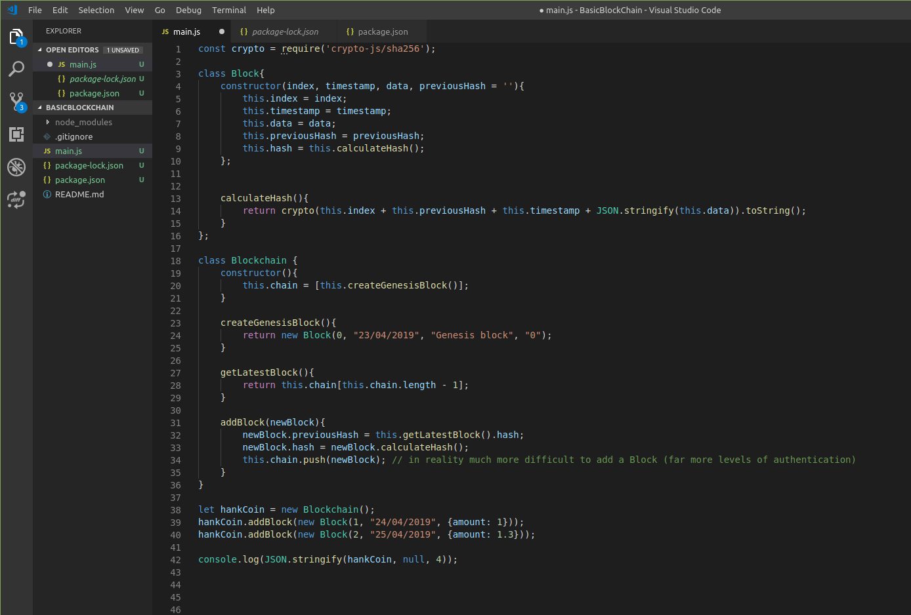

# BasicBlockChain

Screen shot of functioning Block chain without verification of the integrity of the block chain..

That is.. before adding a method on the BlockChain class.

isChainValid() is a method iterating over the block array checking firstly if the currentBlock's hash property is equal to the value returned from rehashing this currentBlock's properties (index, timestamp, data and previousHash). And secondly, whether the previousBlock's hash property is equal to the value returned from rehashing this previousBlock's properties (index, timestamp, data and previousHash). From the most recent block all the way to the genesis block. 

-------insert updated picture with verification----

In constructing a block chain anew, first a variable (hankCoin) is assigned a new instance of BlockChain().
The addBlock method chains to hankCoin. A new instance of BlockChain() is passed an argument of a new instance of Block().
In this sense, the addBlock method is one of two links between the two classes as it is a function awaiting a new instance of Block() to be passed through it as an argument allowing successful access to the Block class properties inside the blockchain class, most notably .hash and .previousHash (see bottom for more).
The new instance of Block is has arguments passed into the index, timestamp, data, previousHash parameters respectively.
Additions to the block chain are made from index 1 upwards as a genesis block is necesarrily returned as a result of calling a new instance of Blockchain(). Inside of the Blockchain class, the createGeneisBlock method has the generic arguments of a generic Gensis block passed into a new instance of Block() (the second link between classes) 

*** Interestingly, in the addBlock method the .previousHash property is accessed and the value of the property is reassigned to the value of the hash property of the block that came before the block in question. This intersection allows for successful iteration back to the Genesis.  

